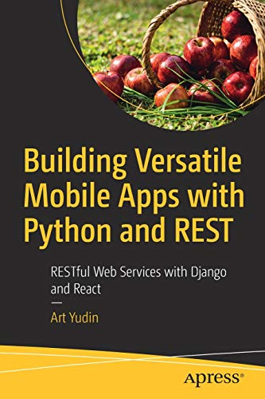

# Building Versatile Mobile Apps with Python and REST:
RESTful Web Services with Django and React

1) Starting  
2) Build back-­end  
3) Started with React  
4) Assembling pieces  
5) Introduction to React Native  
6) Mobile app  
7) Assembling mobile application  
8) Production  

Link:

